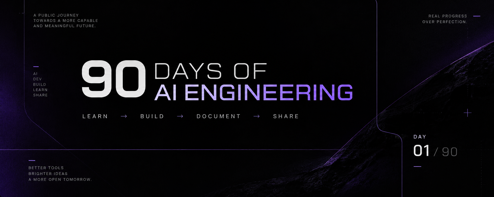

<p align="center">
  
</p>

# 90 Days of AI Engineering

[](PROGRESS.md)
[](PROGRESS.md)
[](LICENSE)

> A public record of Theo Goulart's 90-day journey through AI Engineering: learn deliberately, build useful systems, document the work, and share the evidence.

## Current status

> **Day 01 / 90 — Completed**  
> The first day established the operating standard through Microsoft Learn study and a documented daily record.

| Days | Credentials | Projects | Open Source PRs | LinkedIn posts |
| :---: | :---: | :---: | :---: | :---: |
| **1 / 90** | 1 | 0 | 0 | 0 |

**Current mission:** Day 01 completed. Prepare the next focused study and documentation cycle.

## The project

For 90 consecutive days, I will study relevant AI Engineering topics, build practical projects, document what I learn, and share the results publicly.

This repository exists to make professional growth inspectable. It will collect the reasoning, experiments, technical notes, projects, credentials, contributions, and lessons behind the journey as they happen.

The objective is not activity for its own sake. It is credible evidence of growth across AI Engineering, Software Engineering, and digital product development.

## How to follow

1. Read the [roadmap](ROADMAP.md) for the intended direction.
2. Check [PROGRESS.md](PROGRESS.md) for the latest state and evidence index.
3. Open the numbered entries in [`days/`](days/) to follow the daily story.
4. Explore [projects](projects/), [notes](notes/), [credentials](credentials/), and [Open Source contributions](open-source/).
5. Public LinkedIn updates will be linked from the relevant daily entries and progress log.

## Learn → Build → Document → Share

| Stage | Practice |
| --- | --- |
| **Learn** | Study concepts, tools, papers, documentation, and relevant certifications. |
| **Build** | Turn learning into experiments, features, or useful products. |
| **Document** | Record decisions, results, limitations, and lessons clearly. |
| **Share** | Publish the work through GitHub, LinkedIn, and eventually my personal website. |

This is a feedback loop, not a checklist: each stage should improve the next.

## Repository structure

```text
.
├── assets/          # Curated images and supporting media
├── credentials/     # Earned credentials and verifiable references
├── days/             # One folder per day: study, work, evidence, and lessons
├── notes/            # Standalone technical notes and experiments
├── open-source/      # Open Source contributions and PR records
├── projects/         # Practical projects built during the journey
├── templates/        # Reusable documentation templates
├── CONTRIBUTING.md
├── LICENSE
├── PROGRESS.md
├── README.md
├── ROADMAP.md
└── VISUAL-IDENTITY.md
```

## Principles

- Real work over artificial activity.
- Evidence over claims.
- Clear writing over volume.
- Small, complete iterations over unnecessary complexity.
- Honest progress, including uncertainty and failed experiments.

## Roadmap

The journey moves through [three phases](ROADMAP.md): foundation, application, and proof and contribution. The plan is intentionally adaptable; evidence and project quality matter more than completing a predetermined topic list.

## About

I am Theo Goulart, a developer focused on AI Engineering, Software Engineering, and digital products.

This repository is maintained as a public portfolio artifact. See [CONTRIBUTING.md](CONTRIBUTING.md) for the documentation conventions used throughout the journey.
