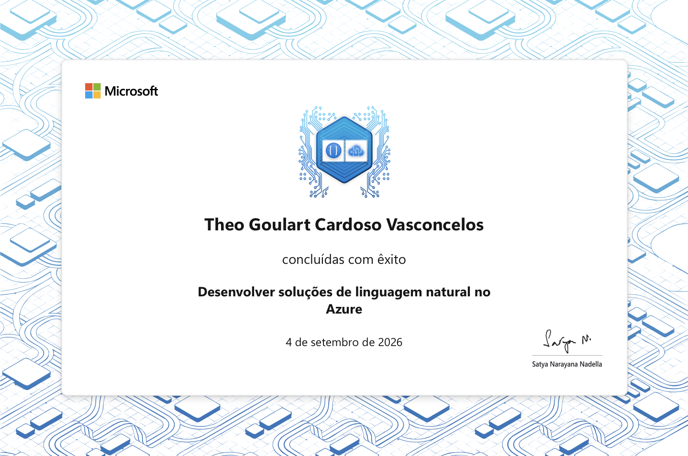

# Develop Natural Language Solutions in Azure

## Credential name

Develop natural language solutions in Azure

## Provider

Microsoft Learn

## Completion date

2026-09-04

## Skills covered

- Natural language processing on Azure
- Microsoft Foundry tools
- Language analysis
- Speech transcription and synthesis
- Language translation

## Evidence files

| File | Status |
| --- | --- |
| `certificate.png` | Official evidence |
| `achievement.png` | To be added |
