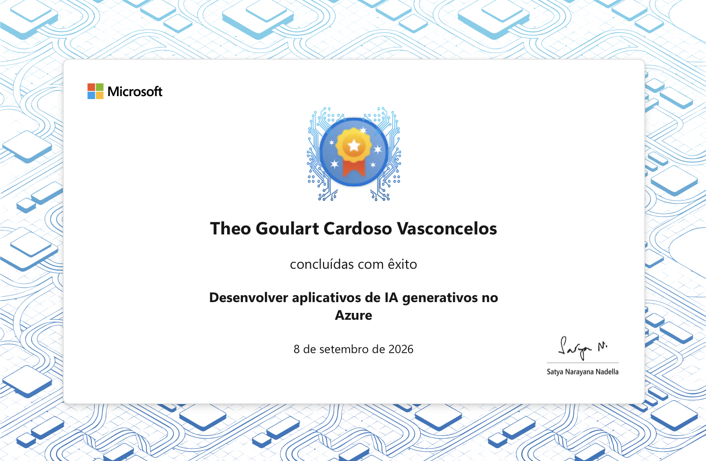

# Desenvolver Aplicativos de IA Generativos no Azure

## Credential name

Desenvolver aplicativos de IA generativos no Azure

## Provider

Microsoft Learn

## Completion date

2026-09-08

## Skills covered

- Generative AI application development on Azure
- Microsoft Foundry
- Model selection, deployment, and evaluation
- Generative AI chat applications
- Tool use in generative AI applications
- Prompt engineering, RAG, and fine-tuning
- Responsible AI implementation

## Evidence files

| File | Status |
| --- | --- |
| `certificate.png` | To be added |
| `achievement.png` | To be added |

